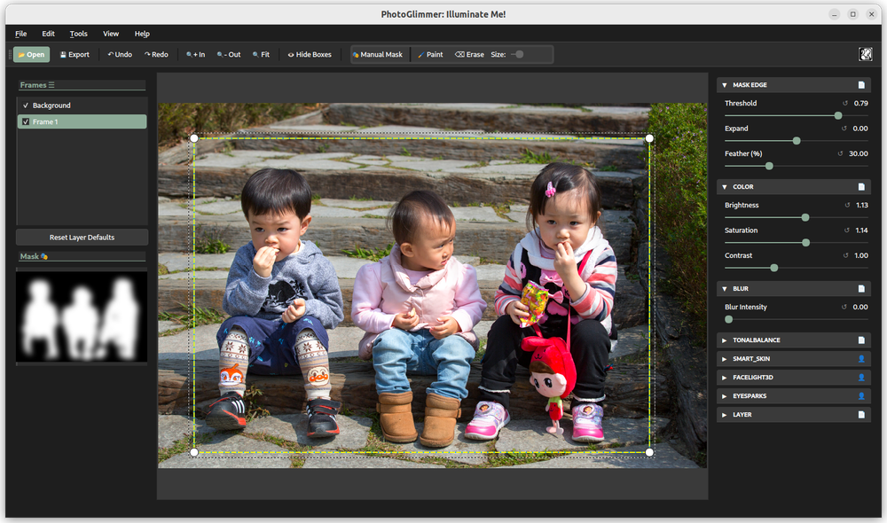
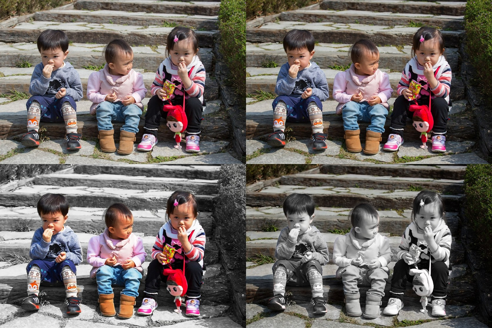

# PhotoGlimmer - Illuminating  People In Photos  

#### ✨✨ The photo editor that makes you look as sharp as the landscape behind you (or the vice versa) ✨✨

 
 

#### ✨✨ V 0.5.0 (Augus 2025) is coming soon ✨✨
        * Multiple enhancements under the hood       
        * Code Upgrade to Qt6 and Pyside6           
        * Improvements made to installers  

>  ⚡⚡ New contributor :   [Stephan Schielke](https://github.com/stephanschielke/) ⚡⚡

 

#### ✨✨ New Help Website on Github Pages : [Home](https://codecliff.github.io/photoglimmer/)  | [User Manual](https://codecliff.github.io/photoglimmer/photoglimmer_help.html) | [Interactive](https://codecliff.github.io/photoglimmer/photoglimmer_guide.html) | [FAQs](https://codecliff.github.io/photoglimmer/photoglimmer_help.html#faq)  ✨✨

#### ✨✨ New Features Added In June 2025 Version 0.4 ✨✨
        * Mouse drawn selection to aid or restrict AI human detection          
        * Preference Dialog 
        * Choice of start directory
        * Image Preview in File Open dialog 
        * Gimp like Curves for brightness tweaking (Experimental / optional :: see preferences )
        * No-restart preference switching
        * Help Menu
        * Online help page with FAQ
        * Online interactive graphical help page     

#### ✨✨💻 💻  Download Version 0.4 Binaries 💻 💻 ✨✨         

> - 💻 **Linux Appimage:** Download, make executable, and run 
    * [Appimage for All Linux flavors](https://github.com/codecliff/PhotoGlimmer/releases/download/v0.4.0_linux/PhotoGlimmer-0.4.0-x86_64.AppImage)
> - 💻 **Ubuntu .deb Installer**: Download and install using apt or gdebi 
    * [Deb for Ubuntu](https://github.com/codecliff/PhotoGlimmer/releases/download/v0.4.0_linux/photoglimmer_0.4.0-1.ubuntu-jammy_amd64.deb)
> - 💻 **Windows Installer:** Download and install, tested on Windows11 
    * [Msi Installer](https://github.com/codecliff/PhotoGlimmer/releases/download/v0.4.0_win/PhotoGlimmer-0.4.0.msi) 

 

[ SHA256 sums  _:    bb082f8126236be4078b14183308f21f71183e802f4a192765bc923e25a4c5b4 ,   bb082f8126236be4078b14183308f21f71183e802f4a192765bc923e25a4c5b4 ,   c2de387f16efde3c4cfa9802d085d66b6377268684348352923f6e5cb50400c9 ]_ 

 

  All releases can also be found onthe [release page](https://github.com/codecliff/PhotoGlimmer/releases) ( expand the **Asset** sections ) 

 
 

# About PhotoGlimmer

PhotoGlimmer is an image editing application that leverages Artificial Intelligence tools to separate people in the image from the background, and allows you to tweak the two separately. 

Therefore, you can brighten all the people in an image while darkening or softening the background, or vice versa.

It can handle large images and does not require a GPU. It's a totally local and offline graphical  application, primarily for Linux Desktops. 

It has evolved from something I had originally written to improve a number of photographs in my own collection. As an avid photographer I had countless  photos of family , travels,landscapes  and even  indoor parties where the background was stunning but the people in foreground were underlit and looked dim in comparison. I could see that a better illumination of faces would do a world of good to the photo, yet was not too keen on painstakingly selecting shapes on GIMP. This app uses Mediapipe and Opencv and improves lighting on people with a couple of gentle nudges to 2-3 sliders. 

In short, if you are an AI enthusiast photographer, it is the user-friendly segmentation tool you have been thinking of developing yourself for last few years :-) Though it's perfectly useful for an everyday common user like me. 

Beware- Unlike a phone app, PhotoGlimmer gives you full control of the segmentation and illumination process and it's easy to go overboard. But as you will see, it does the work in more than 95% of cases. The only caveat is that the image should not be too cluttered to segregate foreground(people) form the background.

# Screenshot

  
    Photo Credit: <a href="https://www.flickr.com/photos/portishead520/16524721706/#">Flickr cc </a> 

# Samples

  
    Photo Credit: <a href="https://www.flickr.com/photos/portishead520/16524721706/#">Flickr cc </a> 

# Features
- **Smart people identification:** PhotoGlimmer's intelligent algorithms demarks people and background in an image

- **No need of manual masking** 

- ** Foreground/People/Face Lighting**: 

- ** Background Illumination/Darkening  **

- ** Background Defocus (Blur)  ** 

- **Seamless toggle between background and foreground **

- **Background Preservation**: Say goodbye to painstaking masking and cropping. A few nudges at the sliders ensure that your enhanced foreground blend seamlessly with the original background.

- **Lean and Intuitive Interface - just some sliders **:  

- **GPU Not Required**:  

- **Large Image Sizes**:  PhotoGlimmer can handle large image dimensions like 6000x4000 megapixels (10-15 MBs) 

- **Local Processing**: Resides completely on your computer.

- **Self contained**: Installation does not mess with system's python setup. 

- **Privacy**: Local processing.Therefore no data is sent to any servers.

- **Retains Exif Data**

# Requirements

## Packaged/Installable  version: 

The packaged/Installable  version of PhotoGlimmer includes all its dependencies and **the user does NOT need to install anything** other than Python 3.8+ 

So, if you are using the .deb or .AppImage version, you need to have only **Python version 3.8 or above**

## Running From Source Code  

- **Python 3.8+**
- **Qt 5 5.12+**
- **Python Packages**:
    - opencv-contrib-python~=4.8
    - PySide2~=5.15
    - mediapipe~=0.10
    - numpy~=1.19
    - pyqtdarktheme ~=2.1.0
    - splines ~= 0.3.0

## Tested On:
- Ubuntu 22.04 
- Fedora Linux 35 (VM, 4 GB RAM) (v 0.3.0 tested)
- Windows11

# Installation and Running: 

> [!NOTE]
> Latest binary installers are at the top of this Readme
> Previous Version binaries at the bottom 
> [All Binary Release Assets](https://github.com/codecliff/PhotoGlimmer/releases/). 

## Method 1. Appimage (Any Linux):

- Just download the Appimage file and execute. 
- You don't need to install anything, appimages have everything and the kitchen sink bundled in.
- You might need to set the Appimage file as executable 

## Method 2. Install .deb (Ubuntu) : 

- This method gives you the better integration with OS. You can just right-click on images and open them in PhotoGlimmer
- All requirements are bundled in the installer itself. You don't need to install any requirements
- Installing through this .deb file does not pollute your system environment.  Photoglimmer and all its required software is contained in its own bundle and do not interfere with versions of stuff already installed on the system 

## Method 3. Executing from source code (All OSs including Windows) :

Follow these steps to install dependencies and run PhotoGlimmer :

1. Create a python environment with python 3.8/3.9 
2.  Activate this environment 
3. Install requirements as above
4. Then- 
    * `git clone https://github.com/codecliff/PhotoGlimmer.git`
    * `cd PhotoGlimmer` 
    * `python photoglimmer/` **OR** `python photoglimmer/photoglimmer_ui.py `

# Using the software (User Guide) : 

## Some Basics: 

- All editing is done with the help of 3 or 4  sliders
- Hover over each element to know what that element does
- Result image is previewed on the right, while the current selection mask appears as a small black and white image on left. 

- **Main Sliders:**
    +  Brightness and saturation  of selected area can be tweaked with the relevant slider
    +  **Selection can be grown or shrunk  by using the ``Threshold`` slider**
    +  **The ``Edge Blur`` slider blends the edited portion smoothly with background

    
## Process for editing an image: 
- Open an image in PhotoGlimmer
- Slide the brightness slider a bit. Apart form showing your edited image, now the application will also show the current section mask 
- You might need to grow or shrink the selection with ``Threshold`` slider
- If the edits start looking patchy , increase the ``Edge Blur`` . This will make the edited portion blend seamlessly with its background
- Press mouse button on the image to compare edit with original image
- When satisfied , Save the edited Image. 
- Note- on  ``save``, the processing might take significantly longer than previous edits.This is because previous edits were being made on a scaled-down version of the image. 

## Known Issues/Limitations: 

- <strike>As of now, the the application discards the EXIF data of the image. (Implemented in V 0.3.0)</strike> 
- <strike>You cannot simultaneously edit both background and foreground in one session. (Implemented in V 0.3.0)</strike> 
- <strike>No Preference Dialog</strike> 
- Reset messes up image display height
- Issue Tracker is here:  [Issues](https://github.com/codecliff/photoglimmer/issues)

#### ✨✨ Previous Version (v0.3) Binaries ✨✨         

- **Linux Appimage:** Download, make executable and run
    * [Appimage for All Linux flavors](https://github.com/codecliff/PhotoGlimmer/releases/download/v0.3.0_u22.04py3.10/PhotoGlimmer-0.3.0-x86_64.AppImage)
- **Ubuntu .deb Installer**: Download and install using apt or gdebi
    * [Python 3.8/Ubuntu 20.04](https://github.com/codecliff/PhotoGlimmer/releases/download/v0.3.0_linux/photoglimmer_0.3.0-1.ubuntu-focal_amd64.deb)
    * [Python 3.10/Ubuntu 22.04](https://github.com/codecliff/PhotoGlimmer/releases/download/v0.3.0_u22.04py3.10/photoglimmer_0.3.0-1.ubuntu-jammy_amd64.deb)
- **Windows Installer:** Download and install, tested on Windows11 
    * [Msi Installer](https://github.com/codecliff/PhotoGlimmer/releases/download/v0.3.0/PhotoGlimmer-0.3.0.msi)

## Acknowledgments:
- [Mediapipe](https://developers.google.com/mediapipe)
- [Opencv](https://opencv.org/)
- [PyQtDarkTheme](https://github.com/5yutan5/PyQtDarkTheme)
- [PyExif](https://pypi.org/user/edleafe/)
- [Beeware](https://beeware.org/project/briefcase/)
- StackOverflow contributors (links in source code)

## License
This Software is released under the [LGPL-2.1  License](https://opensource.org/license/lgpl-2-1/#)

 
 

&#9617;&#9617;&#9617;&#9617;&#9617;&#9617;&#9617;&#9617;&#9617;&#9617;&#9617;&#9617;&#9617;&#9617;&#9617;
&copy; Rahul Singh
&#9617;&#9617;&#9617;&#9617;&#9617;&#9617;&#9617;&#9617;&#9617;&#9617;&#9617;&#9617;&#9617;&#9617;&#9617;

