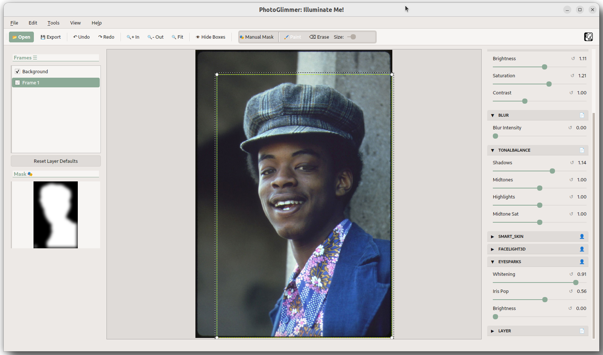

# PhotoGlimmer - Illuminating  People In Photos 
#### ✨✨ The photo editor that makes you look as sharp as the landscape behind you (or the vice versa) ✨✨

> [!NOTE]
> Binary installation files can be found in the [Installation section](#installation-and-running)

# About

PhotoGlimmer is an image editing application that leverages Artifical Intelligence tools to tweak the brightness on people in photos while seamlessly preserving the background. It can handle large images and does not require a GPU. It's a totally local and offline graphical  application, primarily for Linux Desktops. 

It has evolved from something I had originally written to improve a number of phtoographs in my own collection. As an avid photographer I had countless  photos of family , travels,landscapes  and even  indoor parties where the background was stunning but the people in foreground were underlit and looked dim in comparison. I could see that a better illumination of faces would do a world of good to the photo, yet was not too keen on paintstakingly selecting shapes on GIMP. This app uses Mediapipe and Opencv and improves lighting on people with a couple of gentle nudgest to 2-3 slliders. 

In short, if you are an AI enthusiast photographer, it is the user-friendly segmentation tool you have been thinking of deveoping yourself for last few years :-) Though it's perfectly useful for an everyday common user like me. 

Unlike a phone app, Photoglimmer gives you full control of the segmentation and illumination process and it's easy to go overboard. But as you will see, it does the work in more than 95% of cases. The only caveat is that the image should not be too cluttered to segragrate foreground(people) form the background.

# Screenshot

  
    Photo Credit: <a href="https://www.flickr.com/photos/tomvereenooghe/#">Flickr cc </a> 

# Features

- ** Foreground/People/Face Lighting**: PhotoGlimmer intelligently detects people in your photos and helps you manually  enhance the lighting for a natural and appealing look. You can both brighten and darken the people in foreground.

- ** Background Illumination **: Toggle a switch and you can chane the luminosity of background. 

- **Background Preservation**: Say goodbye to painstaking masking and cropping. A few nudges at the sliders ensure that your enhanced foreground blend seamlessly with the original background.

- **Easy Interface**: PhotoGlimmer aims for intuitive and easy-to-use interface, making it accessible for users of all levels.

- **GPU Not Required**:  PhotoGlimmer works on CPU and does not require a GPU .  

- **Large Image Sizes**:  PhotoGlimmer can handle large image dimensions like 6000x4000 megapixels (10-15 MBs) 

- **Local Processing**: Resides completely on your computer.

- **Self contained**: Instalaltion does not mess with system's python setup. 

- **Privacy**: Local processing.Therefore no data is sent to any servers.

# Requirements

## Packaged/Installable  version: 

The packaged/Installable  version of PhotoGlimmer includes all its deprendencies and **the user does NOT need to isntall anything** other than Python 3.8+ 

So, if you are using the .deb or .AppImage version, you need to have only **Python version 3.8 or above**

## Running From Source Code  

- **Python 3.8+**
- **Qt 5 5.12+**
- **Python Packages**:
    - opencv-contrib-python~=4.8
    - PySide2~=5.15
    - mediapipe~=0.10
    - numpy~=1.19
    - pyqtdarktheme ~=2.1.0
    - splines ~= 0.3.0

## Tested On:
- Ubuntu 20.04 
- Fedora Linux 35 (VM, 4 GB RAM)

# Installation and Running: 

> [!NOTE]
> All Binary installation files across versions can be found on the [Release Page ](https://github.com/codecliff/PhotoGlimmer/releases)

### Latest version is v0.2.0 
 available for both [Linux and Windows ](https://github.com/codecliff/PhotoGlimmer/releases)
 
 - Direct linik to  Linux   [Appimage file ](https://github.com/codecliff/PhotoGlimmer/releases/download/v0.2.0_linux/PhotoGlimmer-0.2.0-x86_64.AppImage). 
 - Direct linik to  Ubuntu  [.deb installer ](https://github.com/codecliff/PhotoGlimmer/releases/download/v0.2.0_linux/photoglimmer_0.2.0-1.ubuntu-focal_amd64.deb)
 - Direct linik to  Windows [msi installer ](https://github.com/codecliff/PhotoGlimmer/releases/download/v0.2.0_win/PhotoGlimmer-0.2.0.msi)

   

## Method 1. Appimage (Any Linux):

- Just download the Appimage file and execute. 
- You don't need to install anything, appimages have everything and the kitchen sink bundled in.

## Method 2. Install .deb (Ubuntu) : 

- This method gives you the better integration with OS. You can just right-click on images and open them in PhotoGlimmer
- All requirements are bundled in the installer itself. You don't need to install any requirements
- Installing through this .deb file does not pollute your system environment.  Photoglimmer and all its required software is contained in its own bundle and do not interfere with versions of stuff already installed on the system 

## Method 3. Executing from source code (All OSs including Windows) :

Follow these steps to install dependencies and run PhotoGlimmer :

1. Create a python environment with python 3.8/3.9 
2.  Activate this environment 
3. Install requirements as above
4. Then- 
    * `git clone https://github.com/codecliff/PhotoGlimmer.git`
    * `cd PhotoGlimmer` 
    * `python photoglimmer/` **OR** `python photoglimmer/photoglimmer_ui.py `

# Using the software (User Guide) : 

## Some Basics: 

- All editing is done with the help of 3 or 4  sliders
- Hover over each element to know what that element does
- Result image is previewed on the right, while the current selection mask appears as a small black and white image on left. 

- **Main Sliders:**
    + `#0969DA` Brightness and saturation  of selected area can be tweaked with the relevant slider
    + `#0969DA` **Selection can be grown or shrunk  by using the ``Threshold`` slider**
    + `#0969DA` **The ``Edge Blur`` slider blends the edited portion smoothly with background

    
## Process for editing an image: 
- Open an image in PhotoGlimmer
- Slide the brightness slider a bit. Apart form showing your edited image, now the application will also show the current section mask 
- You might need to grow or shrink the selection with ``Threshold`` slider
- If the edits start looking patchy , increase the ``Edge Blur`` . This will make the edited portion blend seamlessly with its background
- Press mouse button on the image to compare edit with original image
- When satisfied , Save the edited Image. 
- Note- on  ``save``, the processing might take significantly longer than previous edits.This is because previous edits were being made on a scaled-down version of the image. 

## Known Issues/Limitations: 

- ~~As of now, the the application discards the EXIF data of the image.~~(Implemented) 
- You cannot simultaneously edit both bakground and foreground in one session.
- Download size is large due to self-contained nature of application.
- Issue Tracker is here:  [Issues](https://github.com/codecliff/linuxShort/issues)

## Acknowledgements:
- Mediapipe
- Opencv
- qdarktheme
- StackOverflow contributos (links in source code) 

## License
This Software is released under the [LGPL-2.1  License](https://opensource.org/license/lgpl-2-1/) :

 
 

&#9617;&#9617;&#9617;&#9617;&#9617;&#9617;&#9617;&#9617;&#9617;&#9617;&#9617;&#9617;&#9617;&#9617;&#9617;
&copy; Rahul Singh
&#9617;&#9617;&#9617;&#9617;&#9617;&#9617;&#9617;&#9617;&#9617;&#9617;&#9617;&#9617;&#9617;&#9617;&#9617;

