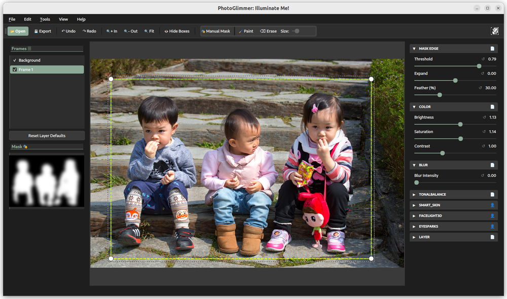
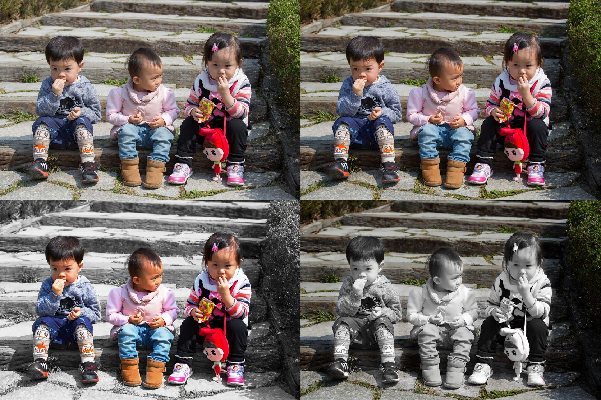

# PhotoGlimmer - Illuminating  People In Photos  

#### ✨✨ The photo editor that makes you look as sharp as the landscape behind you (or the vice versa) ✨✨

 
 

#### 
 ✨✨  Help Website  : [Home](https://codecliff.github.io/photoglimmer/)  | [User Manual](https://codecliff.github.io/photoglimmer/photoglimmer_help.html) | [Interactive](https://codecliff.github.io/photoglimmer/photoglimmer_guide.html) | [FAQs](https://codecliff.github.io/photoglimmer/photoglimmer_help.html#faq)   ✨✨ 

## ✨✨ :rocket: V 0.9.6 (February 2026) is a massive upgrade :rocket: ✨✨
        * Now select multiple people in the image separately 
        * Edit each selection box separately         
        * Multiple new algorithms 
           * Separately edit Mid-tone/Shadow/Highlights
           * Face relighting 
           * Eye enhancement
           * Smart Skin
           * And all the tweaks already available 
           * White Balance, Color Temperature
        * Manual mask edits to enhance generated selections 
        * Live preview for slider move
        * Undo/Redo
        * Zoom/Pan 
        * Multiple application themes
        * Recent Files 
        * Inbuilt help dialogue

 

## ✨✨💻 💻  Download Latest  Version  Binaries 💻 💻 ✨✨         

> - 💻 **V 0.9.6 Beta **:  
    [ All installers for V 0.9.6 Beta ](https://github.com/codecliff/PhotoGlimmer/releases/tag/v0.9.6)

> - 💻 **Ubuntu  22.04 .deb Installer**: Download and install using apt or gdebi 
    * [Snap for Ubuntu 22.04 ](https://github.com/codecliff/PhotoGlimmer/releases/tag/v0.9.6)
> - 💻 **Ubuntu  24.04 .deb Installer**: Download and install using apt or gdebi 
    * [AppImage for All Linux flavors](https://github.com/codecliff/PhotoGlimmer/releases/tag/v0.9.6)  
> - 💻 **Windows Installer:** Download and install, tested on Windows11 
    * [Msi Installer](https://github.com/codecliff/PhotoGlimmer/releases/tag/v0.9.6)
> - 💻 **Linux Flatpak Installer (Experimental):** Download and install 
    * [Flatpak for All Linux flavors](https://github.com/codecliff/PhotoGlimmer/releases/tag/v0.9.6) 

 

 For checksums, refer to [release pages](https://github.com/codecliff/PhotoGlimmer/releases)  

 

  All releases can also be found onthe [release page](https://github.com/codecliff/PhotoGlimmer/releases) ( expand the **Asset** sections ) 

 
 

# About PhotoGlimmer

PhotoGlimmer is an image editing application that leverages Artificial Intelligence tools to separate people in the image from the background, and allows you to tweak the two separately. 

Therefore, you can brighten all the people in an image while darkening or softening the background, or vice versa.

PhotoGlimmer embeds OpenCV and Google's MediaPipe and works totally offline. 

It can handle large images and does not require a GPU. It's a totally local and offline graphical  application, primarily for Linux Desktops. 

It has evolved from something I had originally written to improve a number of photographs in my own collection. As an avid photographer I had countless  photos of family , travels,landscapes  and even  indoor parties where the background was stunning but the people in foreground were underlit and looked dim in comparison. I could see that a better illumination of faces would do a world of good to the photo, yet was not too keen on painstakingly selecting shapes on GIMP. This app uses Mediapipe and Opencv and improves lighting on people with a couple of gentle nudges to 2-3 sliders. 

In short, if you are an AI enthusiast photographer, it is the user-friendly segmentation tool you have been thinking of developing yourself for last few years :-) Though it's perfectly useful for an everyday common user like me. 

Beware- Unlike a phone app, PhotoGlimmer gives you full control of the segmentation and illumination process and it's easy to go overboard. But as you will see, it does the work in more than 95% of cases. The only caveat is that the image should not be too cluttered to segregate foreground(people) from the background.

# Screenshot

  
    Photo Credit: <a href="https://www.flickr.com/photos/portishead520/16524721706/#">Flickr cc </a> 

# Samples

  
    Photo Credit: <a href="https://www.flickr.com/photos/portishead520/16524721706/#">Flickr cc </a> 

# Features
- **Smart people identification:** PhotoGlimmer's intelligent algorithms demarks people and background in an image

- **No need of manual masking** 

- ** Foreground/People/Face Lighting**: 

- ** Background Illumination/Darkening  **

- ** Background Defocus (Blur)  ** 

- **Seamless toggle between background and foreground **

- **Edit each person seaprately, or in group(s) **

- **Background Preservation**: 

- **Lean and Intuitive Interface - just some sliders **:  

- **GPU Not Required**:  

- **Large Image Sizes**:  PhotoGlimmer can handle large image dimensions like 6000x4000 pixels,  upto 50 megapixels, or  10-15 MBs 

- **Local Processing**: Resides completely on your computer.

- **Self contained**: Installation does not mess with system's python setup. 

- **Privacy**: Local processing.Therefore no data is sent to any servers.

- **Retains Exif Data**

# Requirements

## Packaged/Installable  version: 

The packaged/Installable  version of PhotoGlimmer includes all its dependencies and **the user does NOT need to install anything** other than Python 3.8+ 

So, if you are using the .deb or .AppImage version, you need to have only **Python version 3.8 or above**

## Requirements For Running From Source Code  

- create a virtual environment , preferably wiht python 3.10 to 3.12  and  install requirements from requiremtns.txt
- see instructions for execution below  

## Tested On:
- Ubuntu 22.04 , 24.04  
- Fedora Linux 35 (VM, 4 GB RAM) (v 0.3.0 tested)
- Windows11

# Installation and Running: 

> [!NOTE]
> Latest binary installers are at the top of this Readme
> Previous Version binaries at the bottom 
> [All Binary Release Assets](https://github.com/codecliff/PhotoGlimmer/releases/). 

## Method 1. Appimage (Any Linux):

- Just download the Appimage file and execute. 
- You don't need to install anything, appimages have everything and the kitchen sink bundled in.
- You might need to set the Appimage file as executable 

## Method 2. Install .snap (Ubuntu) : 

- This method gives you the better integration with Ubuntu OS. You can just right-click on images and open them in PhotoGlimmer
- All requirements are bundled in the installer itself. You don't need to install any requirements
- Installing through this file does not pollute your system environment.  Photoglimmer and all its required software is contained in its own bundle and do not interfere with versions of stuff already installed on the system 
- if you download the .snap file from github, you can install it with the command : `snap install xyz.snap --dangerous` 
- here substitute xyz with file's actual name 
- that spooky  looking `--dangerous` just shows you are installing from a file instead of using the software store. 
- the snap file is generated right inside github form the source code in the `src/photoglimmer` directory. 

## Method 3. Executing from source code (All OSs including Windows) :

Follow these steps to install dependencies and run PhotoGlimmer :

1. Create a python environment , preferably with python 3.10 to 3.12 
2. Activate this environment 
3. Install requirements from requirements.txt
4. Then- 
    * `git clone https://github.com/codecliff/PhotoGlimmer.git`
    * `cd src ` 
    * `python -m photoglimmer`

    
## Process for editing an image: 
- Open an image in PhotoGlimmer
- Draw rectangles around one or more persons. You can draw multiple rectangles.
- The mask on left will show you the AI has outlined any person(s) in the rectangle 
- Select the rectangle with person you are interested in, and enhance them using sliders on the right
- You can also select the bacgroud from the list (left sidebar) 
- If the edits start looking patchy , increase the `Feathering`` . This will make the edited portion blend seamlessly with its background
- Press middle mouse button on the image to compare edit with original image
- When satisfied , Save (Export) the edited Image. 
- Note- on  ``Export``, the processing might take significantly longer than live edits.This is because live edits were being made on a scaled-down version of the image. 

## Known Issues/Limitations: 

- Pleas add any issues here:  [Issues](https://github.com/codecliff/photoglimmer/issues)

#### ✨✨Previous Version (v0.5) Binaries  ✨✨ 
   [Deb for Ubuntu 22.04 ](https://github.com/codecliff/PhotoGlimmer/releases/download/v0.5.0_U2204/photoglimmer_0.5.0-1.ubuntu-jammy_amd64.deb)
   [Deb for Ubuntu 24.04 ](https://github.com/codecliff/PhotoGlimmer/releases/download/v0.5.0_U2404/photoglimmer_0.5.0-1.ubuntu-noble_amd64.deb)  
   [Msi Installer](https://github.com/codecliff/PhotoGlimmer/releases/download/v0.5.0_Win/PhotoGlimmer-0.5.0.msi)
   [Flatpak for All Linux flavors](https://github.com/codecliff/PhotoGlimmer/releases/download/v0.5.0_Flatpak/PhotoGlimmer-0.5.0-x86_64.flatpak) 

#### ✨✨Previous Version (v0.4) Binaries  ✨✨ 

  [Appimage for All Linux flavors](https://github.com/codecliff/PhotoGlimmer/releases/download/v0.4.0_linux/PhotoGlimmer-0.4.0-x86_64.AppImage) |
  [Deb for Ubuntu](https://github.com/codecliff/PhotoGlimmer/releases/download/v0.4.0_linux/photoglimmer_0.4.0-1.ubuntu-jammy_amd64.deb) |
  [Msi Installer](https://github.com/codecliff/PhotoGlimmer/releases/download/v0.4.0_win/PhotoGlimmer-0.4.0.msi) 

 

## Acknowledgments:
- [Mediapipe](https://developers.google.com/mediapipe)
- [Opencv](https://opencv.org/)
- [PyQtDarkTheme](https://github.com/5yutan5/PyQtDarkTheme)
- [PyExif](https://pypi.org/user/edleafe/)
- [Beeware](https://beeware.org/project/briefcase/)
- StackOverflow contributors (links in source code)

## License
PhotoGlimmer is released under the [LGPL-2.1  License](https://opensource.org/license/lgpl-2-1/#)

 
 

&#9617;&#9617;&#9617;&#9617;&#9617;&#9617;&#9617;&#9617;&#9617;&#9617;&#9617;&#9617;&#9617;&#9617;&#9617;
&copy; Rahul Singh
&#9617;&#9617;&#9617;&#9617;&#9617;&#9617;&#9617;&#9617;&#9617;&#9617;&#9617;&#9617;&#9617;&#9617;&#9617;

